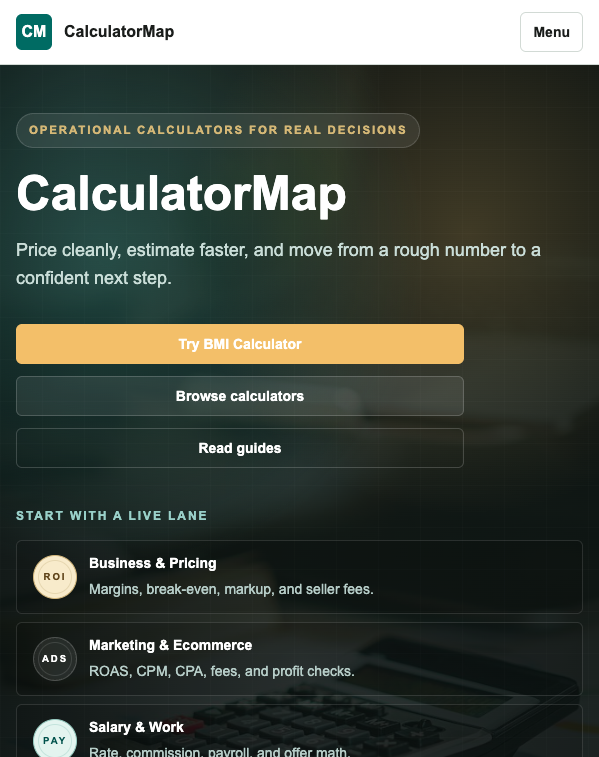
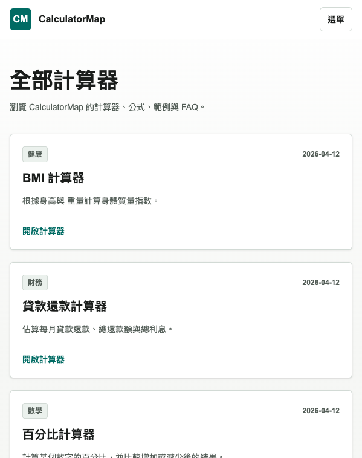
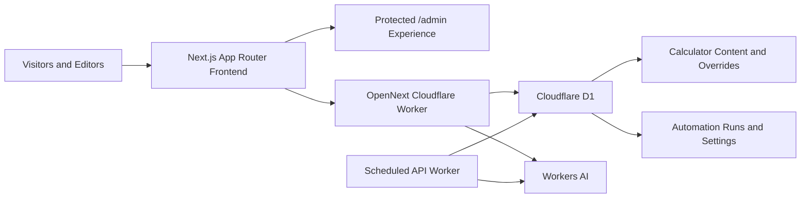

# CalculatorMap

<p align="center">
  <a href="https://calculatormap.com"></a>
  
  
  
  
  <a href="https://github.com/WaterGGAI/calculatormap/actions/workflows/ci.yml"></a>
</p>

CalculatorMap is a Cloudflare-ready calculator platform built with Next.js App Router, a protected admin area, D1-backed content management, and unattended AI SEO automation.

Live site: [calculatormap.com](https://calculatormap.com)

## Screenshots

<p align="center">
  
  
  
</p>

## What This Repository Includes

- Public calculator, category, guide, and static content routes
- Traditional Chinese admin area under `/admin`
- Formula-driven calculator rendering with reusable field schemas
- English and zh-TW localized site output
- SEO metadata, sitemap, robots, and JSON-LD support
- Cloudflare Worker automation for scheduled AI SEO generation
- D1 migrations and seed data for local or remote setup

## Quick Demo

- Homepage: [calculatormap.com](https://calculatormap.com)
- Calculator index: [calculatormap.com/calculators](https://calculatormap.com/calculators)
- Loan payment calculator: [calculatormap.com/calculator/loan-payment-calculator](https://calculatormap.com/calculator/loan-payment-calculator)
- Traditional Chinese calculators: [calculatormap.com/zh-TW/calculators](https://calculatormap.com/zh-TW/calculators)
- Cluster landing pages: [calculatormap.com/clusters](https://calculatormap.com/clusters)
- Protected admin area: `/admin` with HTTP Basic Auth
- Contribution guide: [CONTRIBUTING.md](CONTRIBUTING.md)
- Project roadmap: [ROADMAP.md](ROADMAP.md)
- Code of conduct: [CODE_OF_CONDUCT.md](CODE_OF_CONDUCT.md)
- Security policy: [SECURITY.md](SECURITY.md)

## Product Shape

### Public experience

- Calculator detail pages with formulas, examples, notes, and FAQs
- Category and cluster pages for related decision flows
- Long-form articles connected to calculators and topics
- English default routes plus Traditional Chinese localized routes

### Admin workflows

- Hidden `/admin` console protected with HTTP Basic Auth
- Calculator backlog, categories, FAQs, internal links, media, and SEO screens
- AI SEO settings and manual batch runs
- Cloudflare-backed settings reads and write paths

### Automation layer

- Scheduled Worker entrypoint in `worker/src/index.ts`
- D1-backed automation settings and run history
- Workers AI generation flow for content refreshes and overrides
- Local and remote D1 migration scripts for repeatable setup

## Tech stack

- Next.js
- React
- TypeScript
- Tailwind CSS
- OpenNext for Cloudflare
- Cloudflare Workers, D1, R2, and Workers AI

## Architecture



## Project structure

```text
src/app/                 App Router routes for public pages, localized pages, APIs, and admin
src/components/          Public UI, calculator UI, and admin UI components
src/lib/                 Calculator content, localization, SEO, Cloudflare access, and automation helpers
migrations/              D1 schema and seed data
worker/                  Scheduled API Worker for unattended SEO automation
docs/screenshots/        README screenshots
wrangler.example.jsonc   Public Cloudflare deployment template
wrangler.api.example.jsonc
```

## Getting started

1. Install dependencies:

```bash
nvm use
npm install
```

The repository pins Node `20.20.0` in [`.nvmrc`](.nvmrc) and [`.node-version`](.node-version) for consistent local setup.

2. Copy local environment variables:

```bash
cp .env.example .env.local
```

3. Fill in `ADMIN_USERNAME` and `ADMIN_PASSWORD`.

4. Start the app:

```bash
npm run dev
npm run verify
```

Open `http://localhost:3000` for the public site. Browsers will prompt for credentials when visiting `http://localhost:3000/admin`.

## Common commands

```bash
npm run dev
npm run lint
npm run typecheck
npm run build
npm run verify
npm run preview
npm run worker:dev
```

## Cloudflare setup

This repository keeps live production bindings out of version control.

Create your local deployment files from the public examples:

```bash
cp wrangler.example.jsonc wrangler.jsonc
cp wrangler.api.example.jsonc wrangler.api.jsonc
```

Then update the D1 database IDs, R2 bucket name, routes, and any project-specific bindings for your own account.

Set admin credentials in Cloudflare before production deploys:

```bash
npx wrangler secret put ADMIN_USERNAME
npx wrangler secret put ADMIN_PASSWORD
```

## Deployments

```bash
npm run deploy
npm run worker:deploy
```

## Automation

The API worker can run on a cron schedule and write SEO output back into D1-backed override tables.

Open `/admin/settings` to manage unattended mode:

- enable or pause automation
- set batch size
- set minimum refresh interval
- tune default task, model, tone, length, and temperature
- run a manual batch for verification

## Why Open Source

CalculatorMap is structured so the deployable surface, content model, and automation layer can be studied and adapted without exposing live production bindings. The public repository keeps the real Cloudflare resource IDs out of version control while leaving enough of the app intact to run, inspect, extend, and redeploy in another account.

## Contributing

See [CONTRIBUTING.md](CONTRIBUTING.md) for local setup, scope guidance, and pull request expectations.

## Community

- [CODE_OF_CONDUCT.md](CODE_OF_CONDUCT.md)
- [SECURITY.md](SECURITY.md)

## License

MIT
